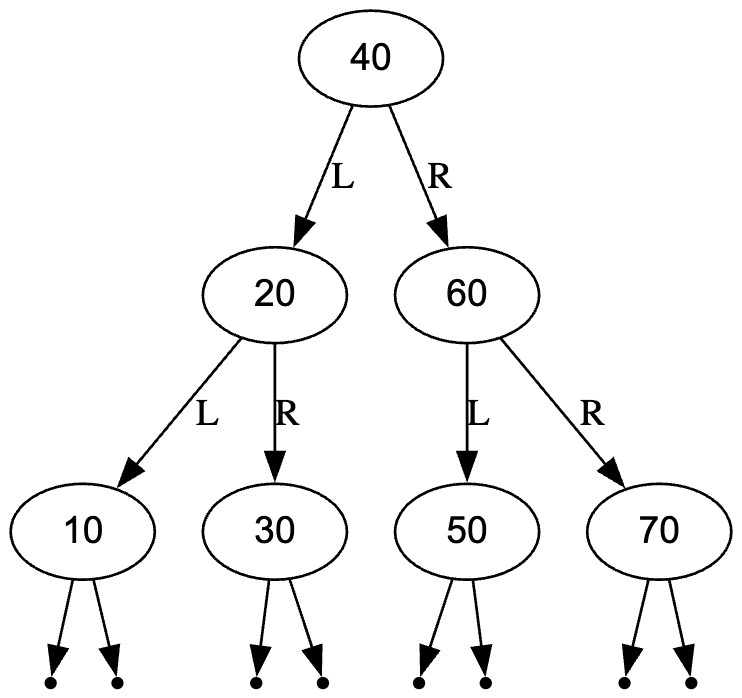

# A03 - BST Delete Method

**Harika Vemulapalli**

---

### Description

This program contains an extended Binary Search Tree (BST) implementation that includes a robust `delete` method. The goal was to maintain the BST ordering property while handling all potential node configurations. The program also utilizes a `GraphvizBST` class to generate visual snapshots of the tree structure before and after deletions. The `delete` method handles the following three cases:

#### Case 1: No Children (Leaf Node)
In the first and most simple case, deleting a node that has no children (a leaf node) is straightforward. We locate the node, free its memory, and set the parent's pointer to `nullptr`. 
1.  Locate the node to be deleted.
2.  Delete the node and free up memory.

#### Case 2: One Child
When deleting a node with only one child, we must prevent the loss of the entire subtree attached to that child. The parent of the node to be deleted must be linked directly to its child. In my program, this is accomplished by identifying which child exists (left or right), saving a temporary pointer to the current node, advancing the root to that child, and then deleting the temporary pointer.
1.  Locate the node to be deleted.
2.  Link the parent and the single child of this node to each other.
3.  Delete the node and free up memory.

#### Case 3: Two Children
In the most complex case where a node has two children, the tree structure must be carefully reordered. To maintain the BST property, the node must be replaced by a value that is larger than the left subtree and smaller than the rest of the right subtree. My program utilizes the **Inorder Successor** method, which finds the smallest value in the right subtree. The data of the target node is overridden with the successor's value, and the successor node (which is guaranteed to be a Case 1 or Case 2 deletion) is then recursively deleted.
1.  Locate node **A** to be deleted.
2.  Find the minimum value in the right subtree of this node, **B** (Inorder Successor).
3.  Override node **A**'s data with **B**'s value.
4.  Recursively delete the original **B** node to clean up the duplicate.

---

### Visual Proof

#### 1. Complex Tree Before Deletions

#### 2. Complex Tree After Deletions (10, 60, 20)

#### 3. Linked List Test (Deleting Middle Node 20)

---

### Files

| # | File | Description |
| :--- | :--- | :--- |
| 1 | `bst.cpp` | Main program containing the BST class, Deletion logic, and Test Cases. |
